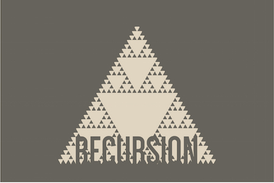
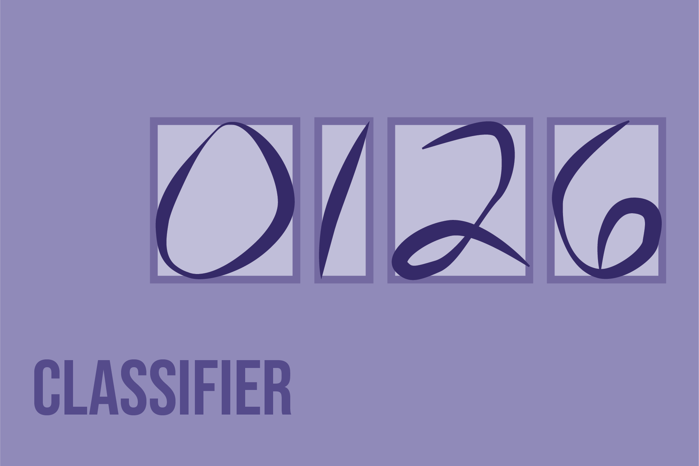

   

 ## COS 126 - Computer Science: An Interdisciplinary Approach  at Princeton University  
 
 This repository contains my Java programming assignments that I completed while taking Princeton's COS 126.
   
   
 ### Course Information
 The course is an introduction to computer science in the context of scientific, engineering, and commercial applications. The course uses the Java programming language to introduce fundamental  programming concepts, including conditionals, loops, arrays, functions, and object-oriented programming. Additional topics include algorithms and data structures; theory of computing; hardware  and software systems; and machine learning.
 
 ### Java Assignments
 Most of the dependencies that I used are contained within the course's algs4.jar. This can be found, along with installation instructions, [at this link](https://algs4.cs.princeton.edu/code).   The same link also has any needed java programs and libraries that may not be in the .JAR file. Note that I littered much of the code with block comments because
 I wanted my logic to be explicit for my grader.
 
 <table style="width:100%">
  <tr>
    <th>Assignment</th>
    <th>Description</th>
    <th>Topics Learned</th>
  </tr>
  <tr>
    <td>
     

       <a href="https://github.com/angelztang/cos126/tree/master/functions"> Assignment 1 </a>
     

       
     </a>
    </td>
    <td>
      
 Implement and test a collection of functions, which manipulate audio and create an audio collage 

    </td>
    <td> 
      
 digital audio manipulation, passing arrays, array functions, audio collage creation, amplify, clamp, reverse, merge, mix, change speed 

    </td>
  </tr>
  <tr>
    <td>
      

        <a href="https://github.com/angelztang/cos126/tree/master/sierpinski"> Assignment 2 </a>
      

        
      </a>       
    </td>
    <td>
      
 Plot a Sierpinski triangle; and plot a recursive pattern of your own design 

    </td>
    <td>
      
 recursive and dynamic programming techniques 

    </td>
  </tr>
   <tr>
    <td>
      

        <a href="https://github.com/angelztang/cos126/tree/master/classifier"> Assignment 3 </a>
      

        
      </a>       
    </td>
    <td>
      
 Write a program to classify images using the perceptron algorithm 

    </td>
    <td>
      
 perceptron algorithm, multi-layer perceptron, gradient descent, image classification, training and testing classifiers, error rate calculation 

    </td>
  </tr>
   <tr>
    <td>
      

        <a href="https://github.com/angelztang/cos126/tree/master/guitar"> Assignment 4 </a>
      

        
      </a>       
    </td>
    <td>
      
 Simulate the plucking of a guitar string using the Karplus–Strong algorithm 

    </td>
    <td>
      
 binary search trees, 2-3 trees, red-black trees, B-trees, kd-trees 

    </td>
  </tr>
   <tr>
    <td>
      

        <a href="https://github.com/angelztang/cos226/tree/master/wordnet"> Assignment 5 </a>
      

             
    </td>
    <td>
      
 Build a <a href="https://wordnet.princeton.edu"> WordNet </a> object with built-in search methods 

    </td>
    <td>
      
 hash tables, depth-first search, breadth-first search, topological sort, minimum spanning trees, Kruskal's algorithm, Prim's algorithm 

    </td>
  </tr>
   <tr>
    <td>
      

        <a href="https://github.com/angelztang/cos226/tree/master/seam"> Assignment 6 </a>
      

             
    </td>
    <td>
      
 Content-aware image resizing API 

    </td>
    <td>
      
 Bellman-Ford algorithm, Dijkstra's algorithm, Ford-Fulkerson algorithm, MinCuts, MaxFlows 

    </td>
  </tr>
    </tr>
   <tr>
    <td>
      

        <a href="https://github.com/angelztang/cos226/tree/master/fraud"> Assignment 7 </a>
      

             
    </td>
    <td>
      
 Machine learning model to detect fraudulent credit card transactions 

    </td>
    <td>
      
 k-means clustering, dimensionality reduction, decision stumps, AdaBoost algorithm, weighted voting 

    </td>
  </tr>
</table>
